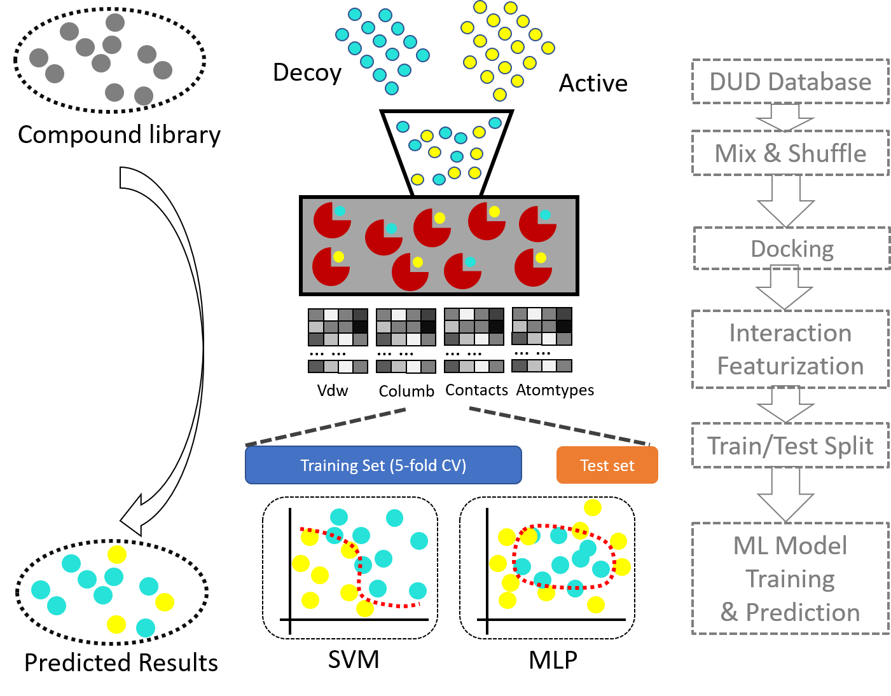
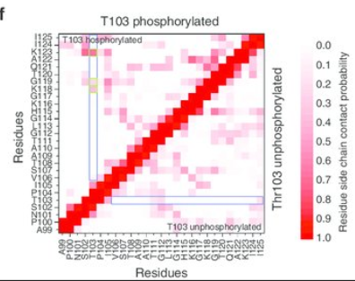

# dockingML: a docking, MD, machine learning pipeline for target specific drug discovery

This project includes modules and scripts for docking prepare, docking results post-processing,
MD simulation prepare and md trajectory post-processing, as well as docking pose based interaction
fingerprints feature generation and machine learning model construction.

The original idea of the project is to combine machine learning with
docking to lower down the false positive rate. Citable paper is coming soon.

    Authors: Zheng Liangzhen, Mu Yuguang.
    Contact: lzheng002@e.ntu.edu.sg
    Institute: School of Biological Sciences, Nanyang Technological University, Singapore

# How to install:
If you have git commond in your system with internet access, you could first download the codes
to local folder, say /home/john/applications.

Issue the following commonds in your terminal (presumably a linux environment):
     
     $ cd /home/john/applications
     $ pip install networkx 
     $ pip install mdtraj
     $ git clone https://github.com/zhenglz/dockingML.git
     $ cd dockingML
     $ pip install ./

Or if you have anaconda in your system, please add the following packages to your environment before you
run the "pip install ."
      
     $ conda create -name mdanaly python=3.6
     $ source activate mdanaly
     $ conda install -c omnia mdtraj 
     $ conda install pandas numpy matplotlib scikit-learn networkx
     $ conda install -c rdkit rdkit
     $ cd $HOME/applications/dockingML
     $ pip install .

# The structure of the codes:

## Docking and docking results parse (dockml)
1 Docking with GOLD or AutoDock Vina  
2 Post-processing the GOLD results  
 
## Molecular Dynamics (autoMD & mdanaly)
### 1. Protein initial structure preparing
The general problem of a protein pdb file is that the pdb file generated 
from an X-ray method would suffer from missing atoms,  sometimes even long missing loops.
In order to preform molecular dynamics, we would firstly add missing atoms, 
sometimes, also need to model the missing loops. So we need find a way, or build a 
pipline to process pdb files (of proteins) to prepare input files for MD and molecular docking.
Update 2017.3.25 Modeller-9.18 was applied to perform protein processing to model the missing atoms. 
PDB2PQR was used to add missing residues where necessary.
To-do: including OpenMM library for PDB structure processing.

### 2. Ligand topology building
Using AmberTool and Acpype, charges and bonding, nonbonding parameters
are calculated using AM1-BCC charge model for large set of ligands. 

The amber general force field GAFF is used for small ligand topology.
Amber format topology files are created and converted to GMX format 

    $ gmx_ligtop -f ligand.pdb -ff gaff -p ligand -amberhome /home/applications/amber16

Additional tools are required for fully functional dockml module.

These tools are:
    
    vina: for molecular docking
    openbabel: for molecule format converting
    acpype: for molecular topology format converting
    pdb2pqr: optional, for molecular format converting
    amber/AmberTools: for molecule topology construction

### 3. Protein Ligand Complex simulation
The complex is then subjected to gromacs for product simulation. 
From python calling system 
commands, we could prepare simple script to run MD simulations. 
To-do: applying OpenMM for simulation.

### 4. Trajectory analysis (mdanaly)
Basic analysis such as contactmap, community analysis, lipid properties,
time series analysis, PMF (1d, 2d), PCA, tSNE, essential dynamics and so on.

Simple ploting routines have also been added. 

## Machine Learning Aid rescoring and virtual screening (dockml)

From the results of md simulation or the results of molecular docking,
we first extract the important features for ML.
Features including, contacts, vdw energy contribution, electrostatic
contributions. All the features are decomposed into single residues,
where backbone and sidechain interactions are separated.
After which, the features are selected based on the distribution,
the difference between plus and minus groups. Only limited number of
features are chosen for ML training. 

### 1 From coordination files to obtain features.

 We prepare a input file, called "input.dat". The file contains two columns. First
column is the filename of a complex file (receptor + ligand) in pdb file format.
Second column is the ligand code, or residue name of the ligand involving the
interactions. 

### 2 Feature clean and selection

Sklearn, numpy and pandas are used for feature clean and selection. 

### 3 Construct machine learning models

Sklearn module is used for ML models

### 4 Rescoring large screening poses and select high potent ligands
The ligand-receptor complex structure could be used to extract their interaction
fingerprints, which could be used for machine learning based classification. The 
classification model then could be used to predict potential receptor binding 
molecules.

 

# Usage examples 
## 1. mdanaly examples
### Using cmap to generate residue-residue contactmap

 Add the /bin directory to your PATH. For example, the package is installed in the 
$HOME/applications/python2.7/lib/python2.7/site-packages/dockingML, you could add
the following in your $HOME/.bashrc file:

 to generate cmap using gmx style script 

    
    $ gmx_cmap.py -h  
    $ gmx_cmap.py -f traj.xtc -s reference.pdb -o cmap.dat -rc A 1 10 -lc A 1 10 -atomtype CA CA
    $ gmx_cmap.py -f traj.xtc -s reference.pdb -o cmap.dat -rc A 1 10 -lc B 15 90 -atomtype CA CA -switch True

## 2. community network work analysis example
The working flow of drawing community network. 

Please cite: (to be added here.)
    
#### 1. construct a cmap
    using distance, or LMI, DCC correlation, generating a residue-residue
    contact/correlation map
    
#### 2. process the cmap
    remove digonal (means setting digonal as zeroes, since they are tightly connected)
    set values (higher than a probability cutoff, say 0.8) as one, loose connecting values
    (less than the cutoff) as zero
    
#### 3. calculate community information
    using \'gncommunities\' generating communities, as well as their betweenness
    
#### 4. get community nodes and edges
    name the communities, get their inter-connection strengths (weighted edges)
    
#### 5. draw community network
    using networkx generating community network plot 

The gmx_network.py script deals with the step 4 and step 5 only.
 
Example commands:
    
    $ network.py -betw betweenness.dat -com commu -domf domain_information.dat -nsf 100 \
    -lwf 0.0001 -fig output_figure.pdf -pos postions.dat

## 3. PCA calculation
Perform PCA calculation based on xtc trajectory files. You could perform XYZ coordination
PCA, or contact map based PCA, or dihedral PCA using gmx style script.

    $ gmx_pca.py -h
    $ gmx_pca.py -mode xyz -f traj.xtc -s reference.pdb -o project_10d.csv -proj 10
      -select CA 
    $ gmx_pca.py -mode cmap -f traj.xtc -s reference.pdb -o project_10d.csv -proj 10
      -select CA
      
## 4. Generate essential dynamics essembles
### TODO: to be completed

